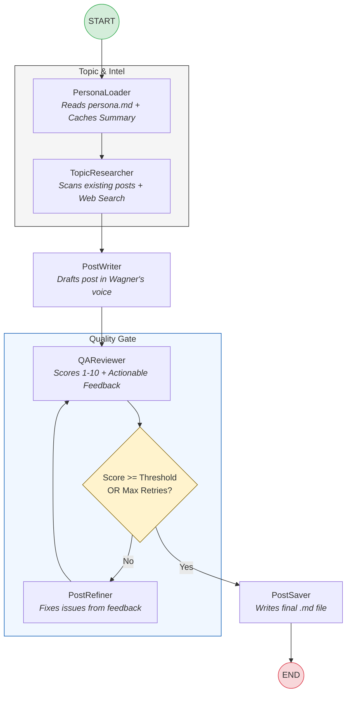

# LinkedIn Post Agent Architecture

This document visualizes the execution flow of the agentic pipeline built with LangGraph.

## Workflow Diagram

## Component Details

- **PersonaLoader:** Analyzes the `persona.md` to extract a consistent voice and technical expertise. Results are cached in `.persona_cache.json` to reduce LLM latency.
- **TopicResearcher:** Evaluates the `config.yaml` queries against existing `.md` files in the output directory to ensure topic variety. Performs a DuckDuckGo search for current trends.
- **PostWriter:** Synthesizes research and persona into a Markdown post.
- **QAReviewer:** A structured output node that evaluates the post against Wagner's specific style rules and a quality threshold.
- **PostRefiner:** Iteratively improves the post based on specific reviewer feedback.
- **PostSaver:** Finalizes the publication by saving the markdown file and running any configured post-save hooks.
